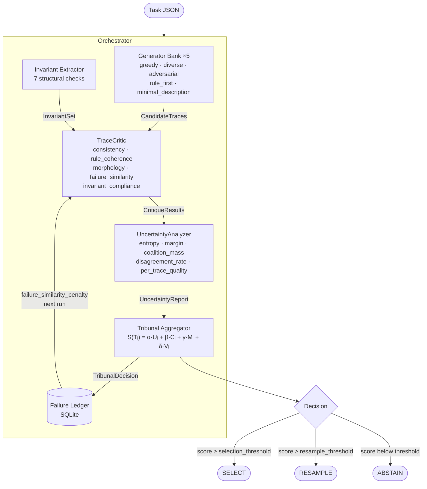
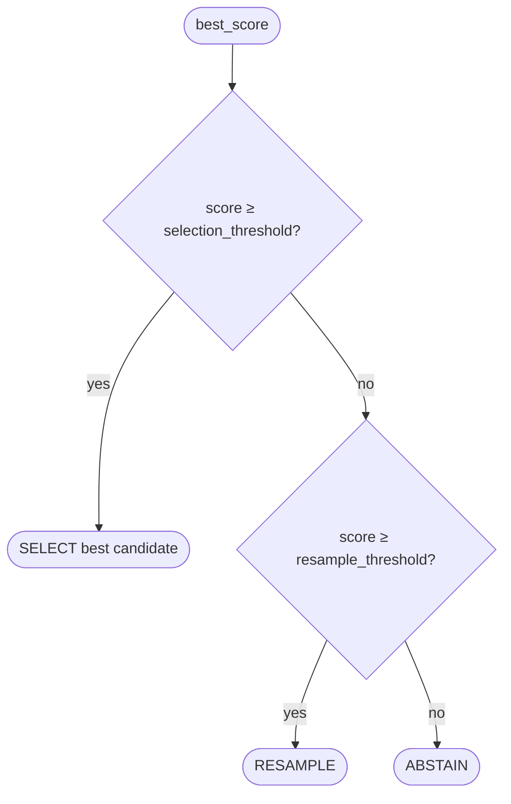
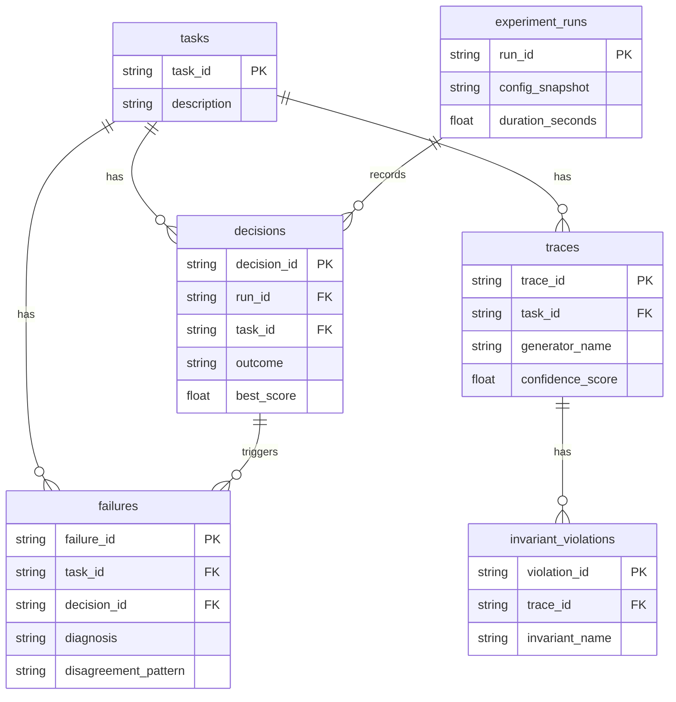
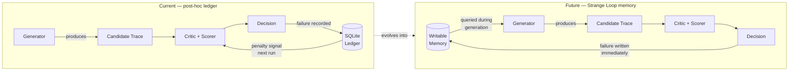

# Sovereign Epistemic Agent

## Epistemic Tribunal

> This repository is the home of the **Sovereign Epistemic Agent** project.
> **Epistemic Tribunal** is its first concrete experimental subsystem — a metacognitive adjudication stack for structured reasoning tasks.
>
> The system does not treat the first plausible answer as sovereign.
> It adjudicates between competing internal accounts of a task.
> The central object is not "the answer" — it is the **governed conflict between candidate hypotheses**.

---

## Table of Contents

1. [What is the Epistemic Tribunal?](#what-is-the-epistemic-tribunal)
2. [How it differs from greedy / single-pass solvers](#how-it-differs-from-greedy--single-pass-solvers)
3. [Architecture overview](#architecture-overview)
   - [Generator bank](#1-generator-bank)
   - [Invariant extractor](#2-invariant-extractor)
   - [Trace critic](#3-trace-critic)
   - [Uncertainty analyzer](#4-uncertainty-analyzer)
   - [Tribunal aggregator](#5-tribunal-aggregator)
   - [Failure ledger](#6-failure-ledger)
4. [Ledger Memory and Strange Loop Memory](#ledger-memory-and-strange-loop-memory)
5. [Project structure](#project-structure)
6. [Installation](#installation)
7. [Running a sample task](#running-a-sample-task)
8. [Running the benchmark](#running-the-benchmark)
9. [Ledger inspection](#ledger-inspection)
10. [Running tests](#running-tests)
11. [Configuration reference](#configuration-reference)
12. [Extending with real model backends](#extending-with-real-model-backends)
13. [Design philosophy](#design-philosophy)
14. [Project Status](#project-status)

---

## What is the Epistemic Tribunal?

The **Epistemic Tribunal** is a metacognitive adjudication stack and the first experimental module of the broader Sovereign Epistemic Agent project. It is a modular Python framework for testing epistemic sovereignty, co-agency, and structured failure reuse on ARC-like reasoning tasks.

Rather than treating answer generation as a linear inference chain, the Tribunal frames it as a *competition between competing generator strategies*. Given a structured reasoning task (here: ARC-like grid transformation puzzles), the system:

1. Generates **multiple candidate reasoning traces** using different competing generator strategies.
2. Infers **task-level invariants** — structural constraints that any valid answer must satisfy.
3. **Critiques each trace** for internal consistency, rule coherence, morphological quality, and similarity to known failure patterns stored in the ledger.
4. Computes **uncertainty signals** across the generator pool — entropy, margin, coalition mass, and pairwise disagreement rate.
5. **Aggregates all signals** through a weighted scoring function to elect the winning trace, request a resample, or abstain.
6. Writes **structured failure records** to a persistent SQLite ledger for post-hoc analysis and future penalisation.

The architecture is domain-agnostic. ARC-like grid tasks are the reference domain, but every module is pluggable and can be replaced with real LLM backends, custom invariant checkers, or alternative critics.

---

## How it differs from greedy / single-pass solvers

| Aspect | Greedy / single-pass | Epistemic Tribunal |
|---|---|---|
| **Candidate generation** | One answer | Multiple competing generator strategies |
| **Invariant awareness** | None | Extracted from training pairs; used to penalise violations |
| **Self-critique** | None | TraceCritic scores every candidate before selection |
| **Uncertainty** | Ignored | Entropy, margin, and coalition mass shape the final decision |
| **Failure memory** | None | Past failures are persisted and used to penalise similar traces |
| **Abstention** | Never | Tribunal abstains or requests resample when confidence is low |
| **Auditability** | Black-box | Full structured decision record in SQLite |

The central object in this system is **not** "the answer" — it is **the competition between internal accounts of the task**. The tribunal adjudicates that competition.

---

## Architecture overview



### 1. Generator bank

> **Clarification:** The current generator bank is a heuristic scaffold whose purpose is to test adjudication dynamics. It is **not** the final sovereign epistemic agent. It is the minimal experimental environment in which tribunal logic — critique, uncertainty measurement, and weighted selection — can be exercised. When real LLM backends are substituted for these heuristics, the tribunal layer remains unchanged.

Five competing generator strategies, each producing a `CandidateTrace`:

| Generator | Strategy |
|---|---|
| `GreedyGenerator` | Extracts the most-frequent colour-to-colour mapping across training pairs and applies it. |
| `DiverseGenerator` | Starts from the greedy answer and stochastically perturbs a fraction of cells to explore the output space. |
| `AdversarialGenerator` | Inverts the greedy mapping to deliberately propose counter-intuitive hypotheses for stress-testing the tribunal. |
| `RuleFirstGenerator` | Evaluates five explicit transformation rules (copy, fill, transpose, flip-h, flip-v) and selects the one with the best training fit. |
| `MinimalDescriptionGenerator` | Applies an Occam's-razor heuristic: simplifies the greedy answer to use the minimum number of distinct colours. |

Each `CandidateTrace` carries:
- `trace_id`, `generator_name`
- `answer` — the predicted output grid
- `reasoning_steps` — human-readable trace
- `confidence_score` — self-reported by the generator
- `derived_features` — structural features (object counts, colour distributions, etc.)

### 2. Invariant extractor

Observes training input/output pairs and infers lightweight structural constraints:

| Invariant | What it checks |
|---|---|
| `object_count_preserved` | Number of connected components stays constant |
| `colour_count_preserved` | Number of distinct colours stays constant |
| `symmetry_expected` | Outputs are horizontally or vertically symmetric |
| `shape_transform_expected` | Output grid dimensions follow the training pattern |
| `size_relation_preserved` | Relative object sizes are preserved |
| `bounding_box_consistent` | Bounding-box coverage ratio is consistent |
| `grid_dimensions_consistent` | Output shape matches the test input shape |

Each invariant carries a **confidence score** (0–1). Only invariants above the configured `confidence_threshold` are enforced during candidate scoring.

### 3. Trace critic

`TraceCritic` scores each candidate on five dimensions:

| Dimension | Proxy metric |
|---|---|
| `consistency_score` | Generator confidence × reasoning step coverage |
| `rule_coherence_score` | Similarity between candidate answer and nearest training output |
| `morphology_score` | Grid shape validity, colour range (0–9), non-trivial structure |
| `failure_similarity_penalty` | Penalises traces matching past failure patterns in the ledger |
| `invariant_compliance_score` | Fraction of active invariants satisfied by the candidate |

Weights are configurable via YAML.

### 4. Uncertainty analyzer

Computes five signals across the full generator pool:

| Signal | Meaning |
|---|---|
| `entropy` | Shannon entropy of the answer cluster distribution (normalised) |
| `margin` | Score gap between the top-2 answer clusters |
| `coalition_mass` | Fraction of generators agreeing with the top answer |
| `disagreement_rate` | Fraction of generator pairs that produce different answers |
| `per_trace_quality` | Per-trace quality score combining confidence and coalition membership |

When token-level probabilities are unavailable (as in mock mode), all signals are derived from inter-trace structural disagreement and confidence metadata.

### 5. Tribunal aggregator

Combines all signals with the weighted scoring function:

```
S(Tᵢ) = α·Uᵢ + β·Cᵢ + γ·Mᵢ + δ·Vᵢ
```

Where:
- **Uᵢ** — uncertainty-derived quality: `per_trace_quality × (0.5 + 0.5 × margin)`
- **Cᵢ** — critic aggregate score
- **Mᵢ** — memory / failure-similarity: `1 − failure_similarity_penalty`
- **Vᵢ** — invariant compliance score

Default weights: `α=0.25, β=0.35, γ=0.15, δ=0.25` (all configurable).

Decision logic:



### 6. Failure ledger

A persistent SQLite database with six tables:

| Table | Contents |
|---|---|
| `tasks` | One row per task |
| `traces` | All candidate traces with JSON-serialised grids |
| `decisions` | Tribunal decisions with score breakdowns |
| `failures` | Structured failure records (violated invariants, diagnosis, disagreement pattern) |
| `invariant_violations` | Per-trace invariant violations |
| `experiment_runs` | One row per end-to-end run with timing and config snapshot |

Failure records are written when the tribunal abstains, resamples, or the selected answer does not match the ground truth. Past failures feed back into the `failure_similarity_penalty` during subsequent evaluations on the same task.



---

## Ledger Memory and Strange Loop Memory

The current SQLite failure ledger is primarily **diagnostic and post-hoc**. It stores structured failure records — violated invariants, disagreement patterns, trace identifiers — for analysis and future penalisation runs. It is not a live writable epistemic memory coupled directly into the generation process. At generation time, the ledger influences scoring through the `failure_similarity_penalty`, but it is not queryable mid-reasoning in the way an active memory organ would be.

A future **Strange Loop memory** would operate differently: it would be queryable *during* reasoning, not merely consulted as a penalty signal after candidates are formed. Such a memory would act more like an internal corrective organ — the system's hypotheses would be shaped by its prior failures before they fully form, not penalised after the fact. This is a substantively different epistemic architecture.

The current ledger should be understood as a **bridge toward that stronger architecture**, not its final form. It establishes the data structures, the failure taxonomy, and the feedback loop that a Strange Loop memory would deepen. The distance between them is the distance between post-hoc audit and live self-correction.



---

## Project structure

```
Sovereign-Epistemic-Agent/
├── README.md
├── pyproject.toml
├── .env.example
├── configs/
│   └── default.yaml
├── data/
│   └── examples/              # 5 synthetic benchmark tasks
│       ├── colour_swap_001.json
│       ├── fill_background_002.json
│       ├── copy_identity_003.json
│       ├── horizontal_flip_004.json
│       └── vertical_flip_005.json
├── docs/
│   └── roadmap.md
├── src/
│   └── epistemic_tribunal/
│       ├── __init__.py
│       ├── config.py           # Pydantic settings + YAML loader
│       ├── cli.py              # Typer CLI
│       ├── types.py            # All shared domain models
│       ├── orchestrator.py     # End-to-end pipeline runner
│       ├── tasks/
│       │   ├── base.py         # Grid utilities (flood-fill, symmetry, etc.)
│       │   └── arc_like.py     # ARC-format JSON loader
│       ├── generators/
│       │   ├── base.py         # BaseGenerator + build_generators()
│       │   ├── greedy.py
│       │   ├── diverse.py
│       │   ├── adversarial.py
│       │   ├── rule_first.py
│       │   └── minimal.py
│       ├── invariants/
│       │   ├── base.py         # BaseInvariantChecker
│       │   └── extractor.py    # 7 checkers + InvariantExtractor
│       ├── critics/
│       │   ├── base.py         # BaseCritic
│       │   └── trace_critic.py # TraceCritic (5 sub-scores)
│       ├── uncertainty/
│       │   ├── base.py         # BaseUncertaintyAnalyzer
│       │   └── analyzer.py     # UncertaintyAnalyzer
│       ├── tribunal/
│       │   ├── aggregator.py   # TribunalAggregator
│       │   └── scoring.py      # Weighted scoring function
│       ├── ledger/
│       │   ├── models.py       # Dataclasses for SQLite rows
│       │   ├── store.py        # LedgerStore (raw SQL)
│       │   └── writer.py       # LedgerWriter (domain → row)
│       ├── evaluation/
│       │   ├── benchmark.py    # BenchmarkRunner
│       │   └── metrics.py      # accuracy, coverage, abstention_rate, …
│       └── utils/
│           ├── ids.py
│           └── logging.py
└── tests/
    ├── conftest.py
    ├── test_config.py
    ├── test_generators.py
    ├── test_invariants.py
    ├── test_trace_critic.py
    ├── test_uncertainty.py
    ├── test_tribunal.py
    ├── test_ledger.py
    ├── test_orchestrator.py
    └── test_integration.py
```

---

## Installation

### Prerequisites

- Python 3.11 or 3.12
- `uv` (recommended) or `pip`

### With uv (recommended)

```bash
# Install uv if you don't have it
pip install uv

# Clone the repository
git clone https://github.com/Steake/Sovereign-Epistemic-Agent.git
cd Sovereign-Epistemic-Agent

# Create a virtual environment and install all dependencies
uv venv
source .venv/bin/activate          # macOS / Linux
# .venv\Scripts\activate           # Windows

uv pip install -e ".[dev]"
```

### With pip

```bash
git clone https://github.com/Steake/Sovereign-Epistemic-Agent.git
cd Sovereign-Epistemic-Agent

python -m venv .venv
source .venv/bin/activate

pip install -e ".[dev]"
```

### Environment variables (optional)

```bash
cp .env.example .env
# Edit .env to override LOG_LEVEL, TRIBUNAL_LEDGER_PATH, etc.
```

---

## Running a sample task

```bash
# Run the tribunal on a single task file
tribunal run data/examples/colour_swap_001.json

# Save results to a specific ledger database
tribunal run data/examples/colour_swap_001.json --ledger data/my_ledger.db

# Output as JSON (useful for scripting)
tribunal run data/examples/colour_swap_001.json --json
```

Example output (illustrative):

```
INFO  Starting tribunal run abc12345 for task colour_swap_001
INFO  Extracted 6 invariant(s) for task colour_swap_001
INFO  Uncertainty: n_traces=5, clusters=3, entropy=0.950, margin=0.400, coalition_mass=0.600, disagreement_rate=0.700
INFO  Decision: select (confidence=1.000)
INFO  Ground-truth match: True

           Tribunal Result
┏━━━━━━━━━━━━━━━━━━━━┳━━━━━━━━━━━━━━━━━━━━━━━━━━━━━━━━━━━━━━┓
┃ Field              ┃ Value                                ┃
┡━━━━━━━━━━━━━━━━━━━━╇━━━━━━━━━━━━━━━━━━━━━━━━━━━━━━━━━━━━━━┩
│ run_id             │ abc12345-...                         │
│ task_id            │ colour_swap_001                      │
│ decision           │ select                               │
│ selected_trace_id  │ cf64f459-...                         │
│ ground_truth_match │ True                                 │
│ duration_seconds   │ 0.012                                │
└────────────────────┴──────────────────────────────────────┘
```

### Task JSON format

Tasks follow an extended ARC format:

```json
{
    "task_id": "my_task",
    "description": "Human-readable description",
    "train": [
        {"input": [[1, 2], [3, 4]], "output": [[2, 1], [4, 3]]}
    ],
    "test": [
        {"input": [[1, 0], [0, 1]], "output": [[0, 1], [1, 0]]}
    ],
    "ground_truth": [[0, 1], [1, 0]]
}
```

Fields:
- `train` — list of input/output pairs used to infer invariants and train the rule-first generator.
- `test[0].input` — the test grid to solve.
- `ground_truth` — optional; enables accuracy evaluation.

---

## Running the benchmark

```bash
# Run over all *.json files in a directory
tribunal benchmark data/examples/

# Save the ledger to a custom path
tribunal benchmark data/examples/ --ledger data/benchmark_ledger.db

# JSON output for downstream processing
tribunal benchmark data/examples/ --json
```

Example output (illustrative; actual values depend on task set and configuration):

```
         Benchmark Metrics
┏━━━━━━━━━━━━━━━━━━━━━━━━━━━━━━━━┳━━━━━━━┓
┃ Metric                         ┃ Value ┃
┡━━━━━━━━━━━━━━━━━━━━━━━━━━━━━━━━╇━━━━━━━┩
│ total_runs                     │ 5     │
│ accuracy                       │ 0.6   │
│ coverage                       │ 1.0   │
│ abstention_rate                │ 0.0   │
│ resample_rate                  │ 0.0   │
│   decision_distribution.select │ 5     │
│ avg_duration_seconds           │ 0.012 │
└────────────────────────────────┴───────┘
```

---

## Ledger inspection

```bash
# Show high-level statistics
tribunal ledger stats --ledger data/benchmark_ledger.db

# Inspect all records for a specific task
tribunal ledger inspect --task-id colour_swap_001 --ledger data/benchmark_ledger.db

# JSON output
tribunal ledger inspect --task-id colour_swap_001 --json
```

---

## Running tests

```bash
# Run the full test suite
pytest

# Run with verbose output
pytest -v

# Run a specific module
pytest tests/test_orchestrator.py

# Run with coverage report
pytest --cov=epistemic_tribunal --cov-report=term-missing
```

---

## Configuration reference

Edit `configs/default.yaml` to tune every aspect of the system:

```yaml
tribunal:
  weights:
    uncertainty: 0.25   # α — weight for uncertainty-derived quality
    critic: 0.35        # β — weight for critic aggregate score
    memory: 0.15        # γ — weight for memory / failure-similarity
    invariant: 0.25     # δ — weight for invariant compliance
  selection_threshold: 0.40   # minimum score to SELECT a candidate
  resample_threshold: 0.20    # minimum score to RESAMPLE (else ABSTAIN)
  max_resample_attempts: 2

generators:
  enabled: [greedy, diverse, adversarial, rule_first, minimal_description]
  seed: 42

invariants:
  confidence_threshold: 0.5
  enabled_checks:
    - object_count_preserved
    - colour_count_preserved
    - symmetry_expected
    - shape_transform_expected
    - size_relation_preserved
    - bounding_box_consistent
    - grid_dimensions_consistent

critic:
  failure_similarity_weight: 0.20
  consistency_weight: 0.30
  rule_coherence_weight: 0.25
  morphology_weight: 0.25

uncertainty:
  min_coalition_mass: 0.6

ledger:
  path: "data/tribunal_ledger.db"
  always_record: false

logging:
  level: "INFO"
  format: "rich"
```

You can also point to a custom config file:

```bash
tribunal run task.json --config configs/my_config.yaml
```

Or use environment variables:

```bash
export TRIBUNAL_LEDGER_PATH=/data/prod_ledger.db
export LOG_LEVEL=DEBUG
```

---

## Extending with real model backends

The system is designed for easy extension. All components use pluggable abstract base classes.

### Replacing a generator with an LLM backend

```python
# src/my_project/generators/llm_generator.py
from epistemic_tribunal.generators.base import BaseGenerator
from epistemic_tribunal.types import CandidateTrace, Task


class LLMGenerator(BaseGenerator):
    """Calls an LLM API to produce a candidate reasoning trace."""

    name = "llm"

    def __init__(self, model: str = "gpt-4o", seed: int = 42, **kwargs):
        super().__init__(seed=seed, **kwargs)
        self.model = model

    def generate(self, task: Task) -> CandidateTrace:
        # Format the task as a prompt, call your LLM, parse the response
        prompt = self._build_prompt(task)
        response = your_llm_client.complete(prompt, model=self.model, seed=self.seed)
        answer, steps = self._parse_response(response)

        return CandidateTrace(
            generator_name=self.name,
            answer=answer,
            reasoning_steps=steps,
            raw_trace=response.text,
            token_count=response.usage.total_tokens,
            confidence_score=response.logprob_to_confidence(),
        )
```

Register it in the generator registry in `generators/base.py`:

```python
from my_project.generators.llm_generator import LLMGenerator

REGISTRY["llm"] = LLMGenerator
```

Then enable it in `configs/default.yaml`:

```yaml
generators:
  enabled: [llm, diverse, rule_first]
```

### Adding a custom invariant checker

```python
from epistemic_tribunal.invariants.base import BaseInvariantChecker
from epistemic_tribunal.types import Task


class ColourSymmetryChecker(BaseInvariantChecker):
    name = "colour_symmetry"

    def check(self, task, candidate_answer=None):
        # Return (holds: bool, confidence: float, note: str)
        ...
```

Add it to `_ALL_CHECKERS` in `invariants/extractor.py`.

### Swapping the uncertainty analyzer

```python
from epistemic_tribunal.uncertainty.base import BaseUncertaintyAnalyzer
from epistemic_tribunal.types import CandidateTrace, Task, UncertaintyReport


class TokenProbAnalyzer(BaseUncertaintyAnalyzer):
    """Uses real token log-probabilities when available."""

    def analyze(self, task: Task, traces: list[CandidateTrace]) -> UncertaintyReport:
        # Compute entropy from actual softmax distributions
        ...
```

Pass your custom analyzer to `Orchestrator`:

```python
from epistemic_tribunal.orchestrator import Orchestrator

orch = Orchestrator(config=cfg)
orch._uncertainty = TokenProbAnalyzer()
```

### Swapping the failure ledger backend

`LedgerStore` wraps raw `sqlite3`. To use DuckDB, implement the same public interface:

```python
class DuckDBLedgerStore:
    def upsert_task(self, rec): ...
    def insert_trace(self, rec): ...
    def insert_failure(self, rec): ...
    def get_failure_patterns(self, task_id=None): ...
    def get_stats(self): ...
    def get_task_summary(self, task_id): ...
```

---

## Design philosophy

The Epistemic Tribunal is built around a single principle: **metacognitive adjudication over competing hypotheses is more robust than greedy answer selection**.

Key ideas:

1. **Multiple hypotheses are cheap; mistakes are expensive.** Running several lightweight competing generator strategies in parallel costs almost nothing. Selecting the wrong answer and propagating that error costs everything.

2. **Invariants are free constraints.** Training pairs reveal structural regularities that valid answers must respect. Enforcing them filters out large classes of wrong hypotheses before any scoring takes place.

3. **Uncertainty is a first-class signal.** When the competing generator strategies strongly disagree, the system should be less confident. Coalition mass, entropy, and margin make that disagreement explicit and actionable.

4. **Failure memory improves over time.** The ledger records not just whether the system was wrong, but *how* it was wrong — which generator strategies were involved, which invariants were violated, what the disagreement pattern looked like. This information feeds back into the `failure_similarity_penalty` on future runs.

5. **Abstention is a valid answer.** A system that knows when it does not know is safer than one that always guesses. The tribunal can abstain or request resampling rather than committing to a low-confidence selection.

6. **Every module is replaceable.** The mock generators, heuristic critic, and proxy uncertainty analyzer are designed to be swapped out for real LLM backends without changing the surrounding architecture.

---

This system is an experiment in epistemic sovereignty. Its purpose is not merely to improve accuracy on ARC-like puzzles, but to test whether a reasoning system can learn to distrust brittle internal consensus, adjudicate between competing stances, and treat failure as reusable knowledge rather than terminal embarrassment. The heuristic generator bank is a stand-in for the real question: what happens when genuine reasoning agents — with divergent internal states, different priors, different failure modes — are subjected to structured adjudication rather than naive ensemble averaging? That question cannot be answered without first building the adjudication layer. This is that layer.

---

## Project Status

### Implemented now

- Full adjudication pipeline: generator bank → invariant extraction → trace critique → uncertainty analysis → tribunal aggregation
- Five heuristic competing generator strategies (greedy, diverse, adversarial, rule-first, minimal-description)
- Seven structural invariant checkers
- Weighted multi-signal scoring with configurable parameters
- SELECT / RESAMPLE / ABSTAIN decision logic
- Persistent SQLite failure ledger with six-table schema
- Post-hoc failure penalisation via `failure_similarity_penalty`
- Pluggable abstract interfaces for all major components
- CLI (`tribunal run`, `tribunal benchmark`, `tribunal ledger`)
- Five synthetic ARC-like benchmark tasks

### Near-term extensions

- LLM-backed generator strategies (replacing heuristic generators with real model calls)
- Token log-probability uncertainty signals
- Expanded benchmark task set
- Richer failure taxonomy and ledger query API

### Long-range research direction

- **Strange Loop writable memory**: a live epistemic memory queryable during generation, acting as an internal corrective organ rather than a post-hoc audit trail
- **Co-agency and operator-mind architecture**: multiple semi-autonomous reasoning agents with distinct epistemic stances, coordinated by the tribunal
- **Gödelian self-reference handling**: mechanisms for the system to reason about the limits of its own adjudication logic, including structured acknowledgment of undecidable cases
- **Generalisation beyond ARC**: applying the adjudication stack to open-ended natural language reasoning and multi-step planning tasks
