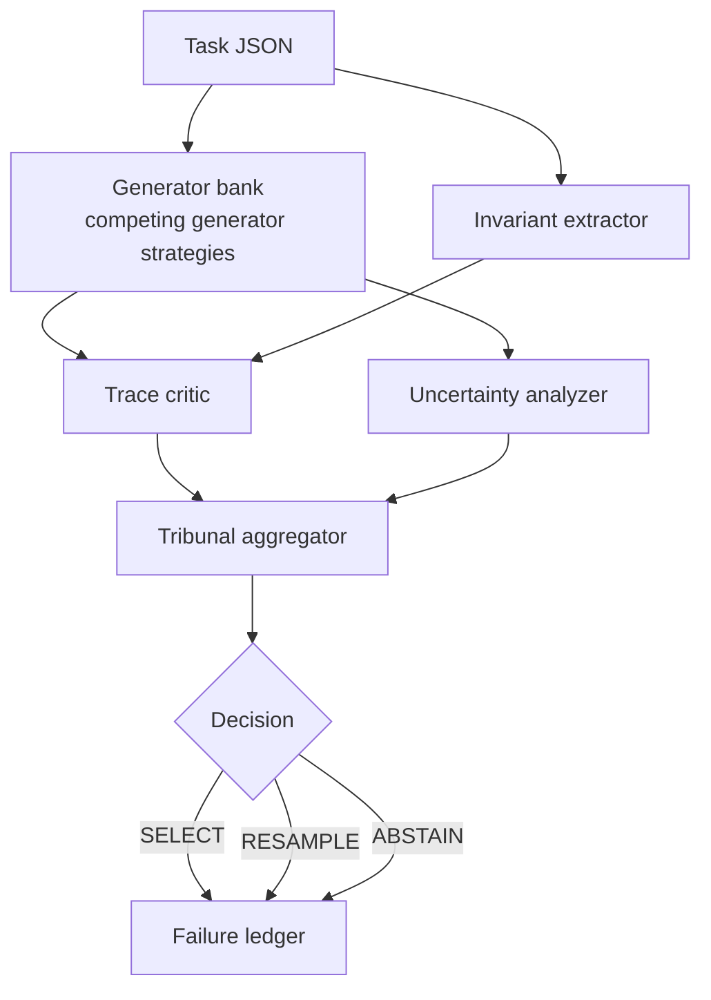

# Sovereign Epistemic Agent

**Read the final experimental audit:** [The Crucible of Reason: An Audit of the Epistemic Tribunal](https://steake.github.io/Sovereign-Epistemic-Agent/)

It is a vanity, and a particularly modern one at that, to assume that simply exposing a Large Language Model to a problem of logic is sufficient to produce reasoning. This repository is the home of the **Sovereign Epistemic Agent** project, and its first concrete experimental subsystem: the **Epistemic Tribunal**.

The system refuses to treat the first plausible answer as sovereign. Instead, it stages a governed, frequently brutal contest between competing internal accounts of a task. It scores those accounts against structural constraints, forces them to justify themselves against prior failure patterns, and then decides whether any candidate deserves selection. 

The central object here is not "the answer." It is the governed conflict between candidate hypotheses.

---

## Table of Contents

1. [What is the Epistemic Tribunal?](#what-is-the-epistemic-tribunal)
2. [Latest Experimental Findings & Next Steps](#latest-experimental-findings--next-steps)
3. [Project Status](#project-status)
4. [How it differs from greedy / single-pass solvers](#how-it-differs-from-greedy--single-pass-solvers)
5. [Architecture overview](#architecture-overview)
6. [Ledger Memory and Strange Loop Memory](#ledger-memory-and-strange-loop-memory)
7. [Installation](#installation)
8. [Running tasks and benchmarks](#running-tasks-and-benchmarks)
9. [Design philosophy](#design-philosophy)

---

## What is the Epistemic Tribunal?

The **Epistemic Tribunal** is a metacognitive adjudication stack. It was built to test whether a reasoning system can distrust its own brittle internal consensus, adjudicate between competing stances, and treat failure as reusable knowledge rather than as a discarded by-product.

Given a structured reasoning task (such as the ARC-AGI benchmark or GSM8K), the tribunal:

1. Generates **multiple candidate reasoning traces** using competing generator strategies.
2. Infers **task-level invariants**: the rigid structural constraints that any valid answer must satisfy.
3. **Critiques each trace** for internal consistency, rule coherence, morphological quality, and similarity to known failure patterns stored in the SQLite ledger.
4. Computes **uncertainty signals** across the generator pool: entropy, margin, coalition mass, and pairwise disagreement rate.
5. **Aggregates all signals** (via `weighted_sum` or `EQBSL` fusion) to elect the winning trace, request a resample, or abstain entirely.
6. Writes **structured failure records** to a persistent ledger for post-hoc analysis and future penalisation.

The architecture is entirely domain-agnostic, though it was hardened in the crucible of ARC grid transformations.

---

## Latest Experimental Findings & Next Steps

Our recent 8-cycle EQBSL (Evidence Quantified Belief Subjective Logic) tuning campaign yielded a bracing conclusion: the tribunal's adjudication logic is highly mature, but it is entirely bottlenecked by the intellectual poverty of its external evidence sources.

**Findings:**
1. **The Evidence Ceiling:** The system correctly abstains from selecting false answers, functioning as an exceptional error gate. However, when the Trace Critic confidently hallucinates a contradiction against the ground truth, the Tribunal—behaving flawlessly according to its charter—rejects the correct answer. The bottleneck is *oracle-limited*, not selector-limited.
2. **The Pathology of the Misshapen Grid is Cured:** By enforcing rigid visual prompt boundaries and a programmatic `shape-clamp` sequence, we successfully reduced LLM spatial hallucinations from an 80% failure rate to 0%. The LLMs now reliably arrive at the courtroom suitably attired.
3. **Intellectual Plurality (M1):** We retained basic coalition margins and injected diversity via a "warm" stochastic LLM. This broke the solipsistic deadlock of pure entropy, doubled resolved accuracy, and proved that the tribunal can filter false positives effectively when fed a properly varied diet of hypotheses.

**Roadmap to Genuine Epistemic Synthesis:**
- **Upgrade the Trace Critic:** The single most critical engineering investment is migrating the Trace Critic to a natively stronger reasoning model (e.g., DeepSeek Reasoner, o1). EQBSL directly amplifies explicit source opinions; it demands a critic with intrinsic epistemic calibration—one that knows when to be uncertain.
- **Elicit True Plurality from the LLM:** The current array struggles with tie-breaks because the prompting variations remain highly correlated. We must extract genuinely orthogonal reasoning pathways *from the LLMs themselves* (e.g., visual reasoning vs. code-execution), rather than falling back on deterministic DSL solvers.
- **Transitioning to Live Memory (Strange Loop):** The current failure ledger is diagnostic and post-hoc. The next architectural frontier is moving toward a true **Strange Loop memory**, injecting prior structural failures directly into the generator bank *during* candidate production.

---

## Project Status

**Implemented now**
- The Epistemic Tribunal stack: competing generator strategies, EQBSL/weighted adjudication, invariant extraction, uncertainty analysis, and persistent SQLite failure ledger.
- A runnable reference environment spanning ARC-AGI and GSM8K tasks.

**Near-term extensions**
- Model upgrades for the Trace Critic to eliminate verification hallucinations.
- Implementation of code-backed generators for orthogonal reasoning priors.

**Long-range research direction**
- The transition from post-hoc ledger analysis to live, writable Strange Loop memory.

---

## How it differs from greedy / single-pass solvers

| Aspect | Greedy / single-pass | Epistemic Tribunal |
|---|---|---|
| **Candidate generation** | One answer | Multiple competing generator strategies |
| **Invariant awareness** | None | Extracted from training pairs; penalises violations |
| **Self-critique** | None | `TraceCritic` scores every candidate before selection |
| **Uncertainty** | Ignored | Entropy, margin, and coalition mass dictate decisions |
| **Failure memory** | None | Past failures are stored to penalise similar future traces |
| **Abstention** | Never | Tribunal abstains or requests resample when confidence is low |
| **Auditability** | Black-box | Full structured decision record in SQLite |

---

## Architecture overview



The system evaluates candidates against five distinct metrics: `consistency_score`, `rule_coherence_score`, `morphology_score`, `failure_similarity_penalty`, and `invariant_compliance_score`. It aggregates these alongside uncertainty signals (`entropy`, `margin`, `coalition_mass`) to produce a final verdict.

---

## Ledger Memory and Strange Loop Memory

The current SQLite failure ledger is primarily **diagnostic and post-hoc**. It stores structured failures for analysis and later penalisation. That matters, but it is **not yet** a live writable epistemic memory.

A stronger **Strange Loop memory** will act less like an archive and more like an internal corrective organ: something the system consults while forming or revising candidate traces, not merely after a run has concluded. The current ledger is a bridge toward that architecture.

---

## Installation

### Prerequisites
- Python 3.11 or 3.12
- `uv` (recommended)

### With uv

```bash
git clone https://github.com/Steake/Sovereign-Epistemic-Agent.git
cd Sovereign-Epistemic-Agent
uv venv
source .venv/bin/activate
uv pip install -e ".[dev]"
```

---

## Running tasks and benchmarks

```bash
# Run a single task
tribunal run data/examples/colour_swap_001.json

# Run a benchmark suite over a directory
tribunal benchmark data/examples/ --ledger data/benchmark_ledger.db

# Inspect the forensic ledger for a specific task
tribunal ledger inspect --task-id colour_swap_001 --ledger data/benchmark_ledger.db
```

Runtime settings are governed by `configs/default.yaml` and can be overridden via `TRIBUNAL_CONFIG_PATH`.

---

## Design philosophy

The Epistemic Tribunal is built around a single, unforgiving principle: **metacognitive adjudication over competing hypotheses is more robust than greedy answer selection**.

1. **Multiple hypotheses are cheap; mistakes are expensive.** Committing too early to the wrong account of a task is fatal.
2. **Invariants are free constraints.** They filter out broad classes of bad candidates before final selection.
3. **Uncertainty is a first-class signal.** When generator strategies strongly disagree, the system should become less confident. 
4. **Abstention is a valid answer.** A system that can refuse a weak internal consensus is immensely safer than one that always emits a confident guess.
