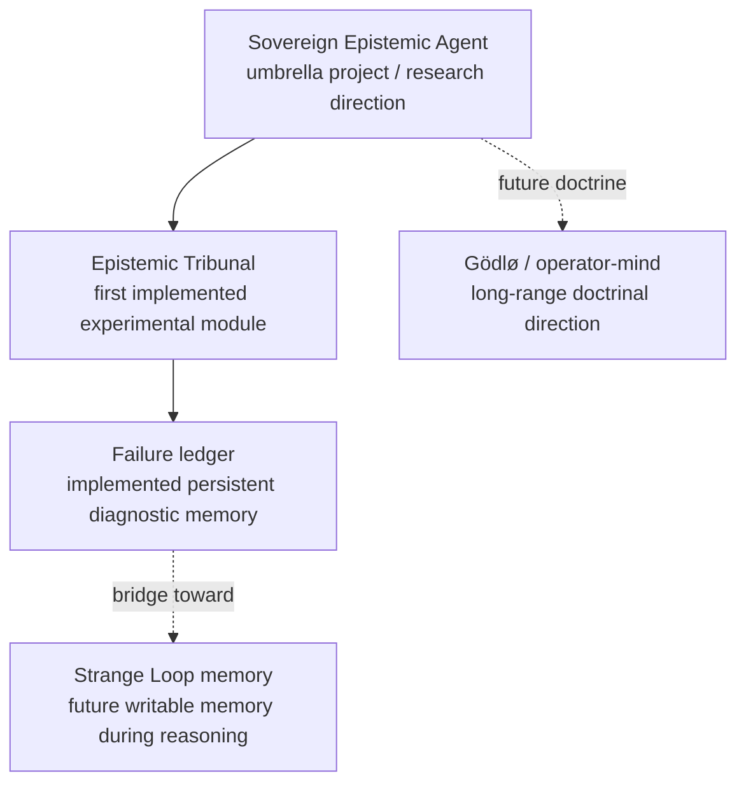
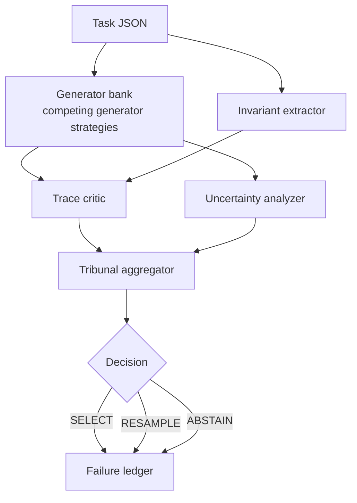

# Sovereign Epistemic Agent

## Epistemic Tribunal

This repository is the home of the **Sovereign Epistemic Agent** project. Its first concrete experimental subsystem is the **Epistemic Tribunal**: a metacognitive adjudication stack for ARC-like reasoning tasks.

The system does not treat the first plausible answer as sovereign. It stages a contest between competing internal accounts of the task, scores those accounts against structural constraints and prior failure patterns, and then decides whether any candidate deserves selection. The central object here is not "the answer." It is the governed conflict between candidate hypotheses.

---

## Table of Contents

1. [What is the Epistemic Tribunal?](#what-is-the-epistemic-tribunal)
2. [Project Status](#project-status)
3. [How it differs from greedy / single-pass solvers](#how-it-differs-from-greedy--single-pass-solvers)
4. [Architecture overview](#architecture-overview)
   - [Generator bank](#1-generator-bank)
   - [Invariant extractor](#2-invariant-extractor)
   - [Trace critic](#3-trace-critic)
   - [Uncertainty analyzer](#4-uncertainty-analyzer)
   - [Tribunal aggregator](#5-tribunal-aggregator)
   - [Failure ledger](#6-failure-ledger)
5. [Ledger Memory and Strange Loop Memory](#ledger-memory-and-strange-loop-memory)
6. [Project structure](#project-structure)
7. [Installation](#installation)
8. [Running a sample task](#running-a-sample-task)
9. [Running the benchmark](#running-the-benchmark)
10. [Ledger inspection](#ledger-inspection)
11. [Running tests](#running-tests)
12. [Configuration reference](#configuration-reference)
13. [Extending with real model backends](#extending-with-real-model-backends)
14. [Design philosophy](#design-philosophy)

---

## What is the Epistemic Tribunal?

The **Epistemic Tribunal** is a **metacognitive adjudication stack** and the first experimental module of the broader **Sovereign Epistemic Agent** project. It is a framework for testing **epistemic sovereignty**, **co-agency**, and **structured failure reuse** under conditions where multiple candidate accounts of a task can conflict.



Given a structured reasoning task (here: ARC-like grid transformation puzzles), the tribunal:

1. Generates **multiple candidate reasoning traces** using competing generator strategies.
2. Infers **task-level invariants**: structural constraints that any valid answer should satisfy.
3. **Critiques each trace** for internal consistency, rule coherence, morphological quality, and similarity to known failure patterns stored in the ledger.
4. Computes **uncertainty signals** across the generator pool: entropy, margin, coalition mass, and pairwise disagreement rate.
5. **Aggregates all signals** through a weighted scoring function to elect the winning trace, request a resample, or abstain.
6. Writes **structured failure records** to a persistent SQLite ledger for post-hoc analysis and later penalisation.

The architecture is domain-agnostic. ARC-like grid tasks are the reference domain, but the same adjudication pattern can be extended with different generators, critics, invariant checkers, or model backends.

---

## Project Status

**Implemented now**

- The Epistemic Tribunal stack: competing generator strategies, invariant extraction, trace criticism, uncertainty analysis, weighted adjudication, and a persistent SQLite failure ledger.
- A runnable ARC-like reference environment with CLI commands, sample tasks, and tests.

**Near-term extensions**

- Stronger generators and critics, including real model-backed components.
- Tighter coupling between stored failures and live scoring or resampling decisions.
- Alternative persistence backends and richer evaluation workflows.

**Long-range research direction**

- The broader Sovereign Epistemic Agent doctrine: writable memory during reasoning, operator-mind or Gödlø-style co-agency, and systems that treat internal disagreement as governed epistemic material rather than noise.

---

## How it differs from greedy / single-pass solvers

| Aspect | Greedy / single-pass | Epistemic Tribunal |
|---|---|---|
| **Candidate generation** | One answer | Multiple competing generator strategies |
| **Invariant awareness** | None | Extracted from training pairs; used to penalise violations |
| **Self-critique** | None | `TraceCritic` scores every candidate before selection |
| **Uncertainty** | Ignored | Entropy, margin, and coalition mass shape the final decision |
| **Failure memory** | None | Past failures are persisted and used to penalise similar traces |
| **Abstention** | Never | Tribunal abstains or requests resample when confidence is low |
| **Auditability** | Black-box | Full structured decision record in SQLite |

The central object in this system is **not** a single output token or final answer string. It is **the competition between internal accounts of the task**, rendered explicit enough to inspect, criticise, and govern.

---

## Architecture overview



```
Task JSON
   │
   ▼
┌─────────────────────────────────────────────────┐
│               Orchestrator                       │
│                                                  │
│  ┌──────────────┐   ┌───────────────────────┐   │
│  │ Generator    │   │ Invariant Extractor    │   │
│  │ Bank (×5)    │   │ (7 structural checks)  │   │
│  └──────┬───────┘   └──────────┬────────────┘   │
│         │ CandidateTraces       │ InvariantSet    │
│         ▼                      ▼                 │
│  ┌─────────────────────────────────────────┐     │
│  │            TraceCritic                  │     │
│  │  consistency · rule_coherence ·         │     │
│  │  morphology · failure_similarity ·      │     │
│  │  invariant_compliance                   │     │
│  └──────────────────┬──────────────────────┘     │
│                     │ CritiqueResults             │
│  ┌──────────────────▼──────────────────────┐     │
│  │         UncertaintyAnalyzer             │     │
│  │   entropy · margin · coalition_mass ·   │     │
│  │   disagreement_rate · per_trace_quality │     │
│  └──────────────────┬──────────────────────┘     │
│                     │ UncertaintyReport           │
│  ┌──────────────────▼──────────────────────┐     │
│  │          Tribunal Aggregator            │     │
│  │  S(Tᵢ) = α·Uᵢ + β·Cᵢ + γ·Mᵢ + δ·Vᵢ  │     │
│  │  → SELECT | RESAMPLE | ABSTAIN          │     │
│  └──────────────────┬──────────────────────┘     │
│                     │ TribunalDecision            │
│  ┌──────────────────▼──────────────────────┐     │
│  │           Failure Ledger                │     │
│  │  SQLite: tasks · traces · decisions ·   │     │
│  │          failures · violations · runs   │     │
│  └─────────────────────────────────────────┘     │
└─────────────────────────────────────────────────┘
```

### 1. Generator bank

The current generator bank is a **heuristic scaffold** for testing adjudication dynamics. It is **not** the final sovereign epistemic agent. It is the minimal experimental environment in which tribunal logic can be exercised against competing generator strategies.

Five generator strategies currently produce `CandidateTrace` objects:

| Generator | Strategy |
|---|---|
| `GreedyGenerator` | Extracts the most-frequent colour-to-colour mapping across training pairs and applies it. |
| `DiverseGenerator` | Starts from the greedy answer and stochastically perturbs a fraction of cells to explore the output space. |
| `AdversarialGenerator` | Inverts the greedy mapping to deliberately propose counter-intuitive hypotheses for stress-testing the tribunal. |
| `RuleFirstGenerator` | Evaluates five explicit transformation rules (copy, fill, transpose, flip-h, flip-v) and selects the one with the best training fit. |
| `MinimalDescriptionGenerator` | Applies an Occam's-razor heuristic: simplifies the greedy answer to use the minimum number of distinct colours. |

Each `CandidateTrace` carries:

- `trace_id`, `generator_name`
- `answer` — the predicted output grid
- `reasoning_steps` — human-readable trace
- `confidence_score` — self-reported by the generator
- `derived_features` — structural features (object counts, colour distributions, etc.)

### 2. Invariant extractor

Observes training input/output pairs and infers lightweight structural constraints:

| Invariant | What it checks |
|---|---|
| `object_count_preserved` | Number of connected components stays constant |
| `colour_count_preserved` | Number of distinct colours stays constant |
| `symmetry_expected` | Outputs are horizontally or vertically symmetric |
| `shape_transform_expected` | Output grid dimensions follow the training pattern |
| `size_relation_preserved` | Relative object sizes are preserved |
| `bounding_box_consistent` | Bounding-box coverage ratio is consistent |
| `grid_dimensions_consistent` | Output shape matches the test input shape |

Each invariant carries a **confidence score** (0–1). Only invariants above the configured `confidence_threshold` are enforced during candidate scoring.

### 3. Trace critic

`TraceCritic` scores each candidate on five dimensions:

| Dimension | Proxy metric |
|---|---|
| `consistency_score` | Generator confidence × reasoning step coverage |
| `rule_coherence_score` | Similarity between candidate answer and nearest training output |
| `morphology_score` | Grid shape validity, colour range (0–9), non-trivial structure |
| `failure_similarity_penalty` | Penalises traces matching past failure patterns in the ledger |
| `invariant_compliance_score` | Fraction of active invariants satisfied by the candidate |

Weights are configurable via YAML.

### 4. Uncertainty analyzer

Computes five signals across the full generator pool:

| Signal | Meaning |
|---|---|
| `entropy` | Shannon entropy of the answer cluster distribution (normalised) |
| `margin` | Score gap between the top-2 answer clusters |
| `coalition_mass` | Fraction of generator strategies agreeing with the top answer |
| `disagreement_rate` | Fraction of generator-strategy pairs that produce different answers |
| `per_trace_quality` | Per-trace quality score combining confidence and coalition membership |

When token-level probabilities are unavailable, these signals are derived from structural disagreement between candidate traces and confidence metadata.

### 5. Tribunal aggregator

Combines all signals with the weighted scoring function:

```
S(Tᵢ) = α·Uᵢ + β·Cᵢ + γ·Mᵢ + δ·Vᵢ
```

Where:

- **Uᵢ** — uncertainty-derived quality: `per_trace_quality × (0.5 + 0.5 × margin)`
- **Cᵢ** — critic aggregate score
- **Mᵢ** — memory / failure-similarity: `1 − failure_similarity_penalty`
- **Vᵢ** — invariant compliance score

Default weights are configurable in YAML.

Decision logic:

```
if best_score ≥ selection_threshold  → SELECT best candidate
elif best_score ≥ resample_threshold → RESAMPLE
else                                 → ABSTAIN
```

### 6. Failure ledger

A persistent SQLite database with six tables:

| Table | Contents |
|---|---|
| `tasks` | One row per task |
| `traces` | All candidate traces with JSON-serialised grids |
| `decisions` | Tribunal decisions with score breakdowns |
| `failures` | Structured failure records (violated invariants, diagnosis, disagreement pattern) |
| `invariant_violations` | Per-trace invariant violations |
| `experiment_runs` | One row per end-to-end run with timing and config snapshot |

Failure records are written when the tribunal abstains, resamples, or the selected answer does not match ground truth when ground truth is available. Past failures feed back into the `failure_similarity_penalty` during subsequent evaluations on the same task.

---

## Ledger Memory and Strange Loop Memory

The current SQLite failure ledger is primarily **diagnostic and post-hoc**. It stores structured failures for analysis, inspection, and later penalisation during scoring. That matters, but it is **not yet** a live writable epistemic memory coupled directly into generation.

A stronger **Strange Loop memory** would be queryable during reasoning itself. It would act less like an archive and more like an internal corrective organ: something the system can consult while forming or revising candidate traces, not merely after a run has concluded.

The current ledger should therefore be described as a **bridge** toward that stronger architecture, not its final form.


---

## Project structure

```
epistemic_tribunal/
├── README.md
├── pyproject.toml
├── .env.example
├── configs/
│   └── default.yaml
├── data/
│   └── examples/              # Synthetic benchmark tasks
│       ├── colour_swap_001.json
│       ├── fill_background_002.json
│       ├── copy_identity_003.json
│       ├── horizontal_flip_004.json
│       └── vertical_flip_005.json
├── src/
│   └── epistemic_tribunal/
│       ├── __init__.py
│       ├── config.py           # Pydantic settings + YAML loader
│       ├── cli.py              # Typer CLI
│       ├── types.py            # All shared domain models
│       ├── orchestrator.py     # End-to-end pipeline runner
│       ├── tasks/
│       │   ├── base.py         # Grid utilities (flood-fill, symmetry, etc.)
│       │   └── arc_like.py     # ARC-format JSON loader
│       ├── generators/
│       │   ├── base.py         # BaseGenerator + build_generators()
│       │   ├── greedy.py
│       │   ├── diverse.py
│       │   ├── adversarial.py
│       │   ├── rule_first.py
│       │   └── minimal.py
│       ├── invariants/
│       │   ├── base.py         # BaseInvariantChecker
│       │   └── extractor.py    # 7 checkers + InvariantExtractor
│       ├── critics/
│       │   ├── base.py         # BaseCritic
│       │   └── trace_critic.py # TraceCritic (5 sub-scores)
│       ├── uncertainty/
│       │   ├── base.py         # BaseUncertaintyAnalyzer
│       │   └── analyzer.py     # UncertaintyAnalyzer
│       ├── tribunal/
│       │   ├── aggregator.py   # TribunalAggregator
│       │   └── scoring.py      # Weighted scoring function
│       ├── ledger/
│       │   ├── models.py       # Dataclasses for SQLite rows
│       │   ├── store.py        # LedgerStore (raw SQL)
│       │   └── writer.py       # LedgerWriter (domain → row)
│       ├── evaluation/
│       │   ├── benchmark.py    # BenchmarkRunner
│       │   └── metrics.py      # accuracy, coverage, abstention_rate, …
│       └── utils/
│           ├── ids.py
│           └── logging.py
└── tests/
    ├── conftest.py
    ├── test_config.py
    ├── test_generators.py
    ├── test_invariants.py
    ├── test_trace_critic.py
    ├── test_uncertainty.py
    ├── test_tribunal.py
    ├── test_ledger.py
    ├── test_orchestrator.py
    └── test_integration.py
```

---

## Installation

### Prerequisites

- Python 3.11 or 3.12
- `uv` (recommended) or `pip`

### With uv (recommended)

```bash
# Install uv if you don't have it
pip install uv

# Clone the repository
git clone https://github.com/Steake/Sovereign-Epistemic-Agent.git
cd Sovereign-Epistemic-Agent

# Create a virtual environment and install all dependencies
uv venv
source .venv/bin/activate          # macOS / Linux
# .venv\Scripts\activate           # Windows

uv pip install -e ".[dev]"
```

### With pip

```bash
git clone https://github.com/Steake/Sovereign-Epistemic-Agent.git
cd Sovereign-Epistemic-Agent

python -m venv .venv
source .venv/bin/activate

pip install -e ".[dev]"
```

### Environment variables (optional)

```bash
cp .env.example .env
# Edit .env to override LOG_LEVEL, TRIBUNAL_LEDGER_PATH, etc.
```

---

## Running a sample task

```bash
# Run the tribunal on a single task file
tribunal run data/examples/colour_swap_001.json

# Save results to a specific ledger database
tribunal run data/examples/colour_swap_001.json --ledger data/my_ledger.db

# Output as JSON (useful for scripting)
tribunal run data/examples/colour_swap_001.json --json
```

Illustrative output:

```
INFO  Starting tribunal run abc12345 for task colour_swap_001
INFO  Extracted 6 invariant(s) for task colour_swap_001
INFO  Uncertainty: n_traces=5, clusters=3, entropy=0.950, margin=0.400, coalition_mass=0.600, disagreement_rate=0.700
INFO  Decision: select (confidence=1.000)
INFO  Ground-truth match: True

           Tribunal Result
┏━━━━━━━━━━━━━━━━━━━━┳━━━━━━━━━━━━━━━━━━━━━━━━━━━━━━━━━━━━━━┓
┃ Field              ┃ Value                                ┃
┡━━━━━━━━━━━━━━━━━━━━╇━━━━━━━━━━━━━━━━━━━━━━━━━━━━━━━━━━━━━━┩
│ run_id             │ abc12345-...                         │
│ task_id            │ colour_swap_001                      │
│ decision           │ select                               │
│ selected_trace_id  │ cf64f459-...                         │
│ ground_truth_match │ True                                 │
│ duration_seconds   │ 0.012                                │
└────────────────────┴──────────────────────────────────────┘
```

### Task JSON format

Tasks follow an extended ARC format:

```json
{
  "task_id": "my_task",
  "description": "Human-readable description",
  "train": [
    {"input": [[1, 2], [3, 4]], "output": [[2, 1], [4, 3]]}
  ],
  "test": [
    {"input": [[1, 0], [0, 1]], "output": [[0, 1], [1, 0]]}
  ],
  "ground_truth": [[0, 1], [1, 0]]
}
```

Fields:

- `train` — list of input/output pairs used to infer invariants and train the rule-first generator.
- `test[0].input` — the test grid to solve.
- `ground_truth` — optional; enables accuracy evaluation.

---

## Running the benchmark

```bash
# Run over all *.json files in a directory
tribunal benchmark data/examples/

# Save the ledger to a custom path
tribunal benchmark data/examples/ --ledger data/benchmark_ledger.db

# JSON output for downstream processing
tribunal benchmark data/examples/ --json
```

Illustrative output:

```
         Benchmark Metrics
┏━━━━━━━━━━━━━━━━━━━━━━━━━━━━━━━━┳━━━━━━━┓
┃ Metric                         ┃ Value ┃
┡━━━━━━━━━━━━━━━━━━━━━━━━━━━━━━━━╇━━━━━━━┩
│ total_runs                     │ 5     │
│ accuracy                       │ 0.6   │
│ coverage                       │ 1.0   │
│ abstention_rate                │ 0.0   │
│ resample_rate                  │ 0.0   │
│   decision_distribution.select │ 5     │
│ avg_duration_seconds           │ 0.012 │
└────────────────────────────────┴───────┘
```

Treat these numbers as examples from the bundled sample tasks, not fixed performance guarantees.

---

## Ledger inspection

```bash
# Show high-level statistics
tribunal ledger stats --ledger data/benchmark_ledger.db

# Inspect all records for a specific task
tribunal ledger inspect --task-id colour_swap_001 --ledger data/benchmark_ledger.db

# JSON output
tribunal ledger inspect --task-id colour_swap_001 --json
```

---

## Running tests

```bash
# Run the full test suite
pytest

# Run with verbose output
pytest -v

# Run a specific module
pytest tests/test_orchestrator.py

# Run with coverage report
pytest --cov=epistemic_tribunal --cov-report=term-missing
```

Expected result: the suite should pass in your current environment. Exact test counts and timing will change as the code evolves.

---

## Configuration reference

Edit `configs/default.yaml` to tune every aspect of the system:

```yaml
tribunal:
  weights:
    uncertainty: 0.25   # α — weight for uncertainty-derived quality
    critic: 0.35        # β — weight for critic aggregate score
    memory: 0.15        # γ — weight for memory / failure-similarity
    invariant: 0.25     # δ — weight for invariant compliance
  selection_threshold: 0.40   # minimum score to SELECT a candidate
  resample_threshold: 0.20    # minimum score to RESAMPLE (else ABSTAIN)
  max_resample_attempts: 2

generators:
  enabled: [greedy, diverse, adversarial, rule_first, minimal_description]
  seed: 42

invariants:
  confidence_threshold: 0.5
  enabled_checks:
    - object_count_preserved
    - colour_count_preserved
    - symmetry_expected
    - shape_transform_expected
    - size_relation_preserved
    - bounding_box_consistent
    - grid_dimensions_consistent

critic:
  failure_similarity_weight: 0.20
  consistency_weight: 0.30
  rule_coherence_weight: 0.25
  morphology_weight: 0.25

uncertainty:
  min_coalition_mass: 0.6

ledger:
  path: "data/tribunal_ledger.db"
  always_record: false

logging:
  level: "INFO"
  format: "rich"
```

You can also point to a custom config file:

```bash
tribunal run task.json --config configs/my_config.yaml
```

Or use environment variables:

```bash
export TRIBUNAL_LEDGER_PATH=/data/prod_ledger.db
export LOG_LEVEL=DEBUG
```

---

## Extending with real model backends

The system is designed for extension. All components use pluggable abstract base classes.

### Replacing a generator with an LLM backend

```python
# src/my_project/generators/llm_generator.py
from epistemic_tribunal.generators.base import BaseGenerator
from epistemic_tribunal.types import CandidateTrace, Task


class LLMGenerator(BaseGenerator):
    """Calls an LLM API to produce a candidate reasoning trace."""

    name = "llm"

    def __init__(self, model: str = "gpt-4o", seed: int = 42, **kwargs):
        super().__init__(seed=seed, **kwargs)
        self.model = model

    def generate(self, task: Task) -> CandidateTrace:
        # Format the task as a prompt, call your LLM, parse the response
        prompt = self._build_prompt(task)
        response = your_llm_client.complete(prompt, model=self.model, seed=self.seed)
        answer, steps = self._parse_response(response)

        return CandidateTrace(
            generator_name=self.name,
            answer=answer,
            reasoning_steps=steps,
            raw_trace=response.text,
            token_count=response.usage.total_tokens,
            confidence_score=response.logprob_to_confidence(),
        )
```

Register it in the generator registry in `generators/base.py`:

```python
from my_project.generators.llm_generator import LLMGenerator

REGISTRY["llm"] = LLMGenerator
```

Then enable it in `configs/default.yaml`:

```yaml
generators:
  enabled: [llm, diverse, rule_first]
```

### Adding a custom invariant checker

```python
from epistemic_tribunal.invariants.base import BaseInvariantChecker
from epistemic_tribunal.types import Task


class ColourSymmetryChecker(BaseInvariantChecker):
    name = "colour_symmetry"

    def check(self, task, candidate_answer=None):
        # Return (holds: bool, confidence: float, note: str)
        ...
```

Add it to `_ALL_CHECKERS` in `invariants/extractor.py`.

### Swapping the uncertainty analyzer

```python
from epistemic_tribunal.uncertainty.base import BaseUncertaintyAnalyzer
from epistemic_tribunal.types import CandidateTrace, Task, UncertaintyReport


class TokenProbAnalyzer(BaseUncertaintyAnalyzer):
    """Uses real token log-probabilities when available."""

    def analyze(self, task: Task, traces: list[CandidateTrace]) -> UncertaintyReport:
        # Compute entropy from actual softmax distributions
        ...
```

Pass your custom analyzer to `Orchestrator`:

```python
from epistemic_tribunal.orchestrator import Orchestrator

orch = Orchestrator(config=cfg)
orch._uncertainty = TokenProbAnalyzer()
```

### Swapping the failure ledger backend

`LedgerStore` wraps raw `sqlite3`. To use DuckDB, implement the same public interface:

```python
class DuckDBLedgerStore:
    def upsert_task(self, rec): ...
    def insert_trace(self, rec): ...
    def insert_failure(self, rec): ...
    def get_failure_patterns(self, task_id=None): ...
    def get_stats(self): ...
    def get_task_summary(self, task_id): ...
```

---

## Design philosophy

The Epistemic Tribunal is built around a single principle: **metacognitive adjudication over competing hypotheses is more robust than greedy answer selection**.

This system is an experiment in **epistemic sovereignty**. Its purpose is not merely to improve accuracy on ARC-like puzzles, but to test whether a reasoning system can learn to distrust brittle internal consensus, adjudicate between competing stances, and treat failure as reusable knowledge rather than terminal embarrassment.

Key ideas:

1. **Multiple hypotheses are cheap; mistakes are expensive.** Running several lightweight generator strategies in parallel is inexpensive. Committing too early to the wrong account of a task is not.
2. **Invariants are free constraints.** Training pairs reveal structural regularities that valid answers should respect. Enforcing them filters out broad classes of bad candidates before final selection.
3. **Uncertainty is a first-class signal.** When generator strategies strongly disagree, the system should become less confident. Coalition mass, entropy, and margin make that disagreement explicit and actionable.
4. **Failure memory should compound.** The ledger records not just whether the system was wrong, but how it was wrong: which strategies were involved, which invariants were violated, and what the disagreement pattern looked like.
5. **Abstention is a valid answer.** A system that can refuse a weak internal consensus is safer than one that always emits a confident guess.
6. **Every module is replaceable.** The current generators, critic, and uncertainty analyzer are experimental parts of the tribunal stack, not permanent endpoints of the broader project.
