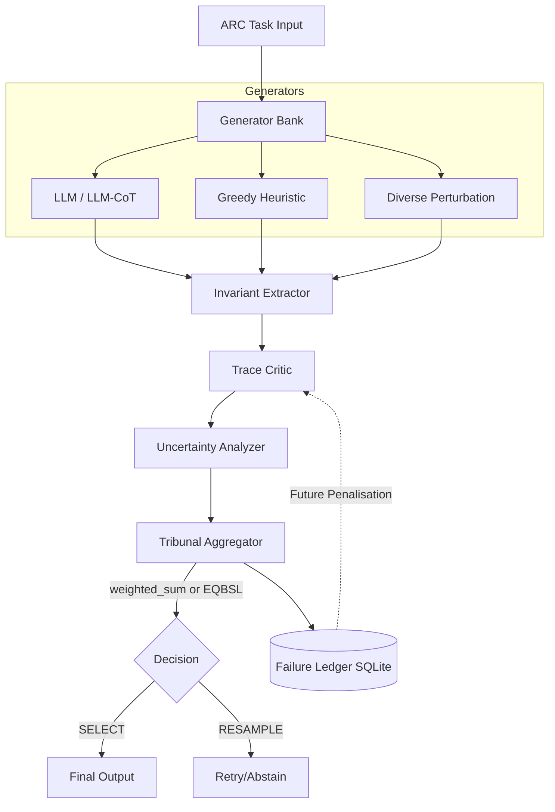

# Sovereign Epistemic Agent

**Research blog for the Epistemic Tribunal project.**

The Epistemic Tribunal is a metacognitive adjudication stack for reasoning tasks. It stages a governed contest between competing internal accounts of a problem, scores those accounts against structural constraints and prior failure patterns, and decides whether any candidate deserves selection.

The central object is not "the answer." It is the governed conflict between candidate hypotheses.

---

## Experiment Reports

<ul>
  
    <li>
      <a href="{{ post.url | relative_url }}">{{ post.title }}</a>
       
      <small>{{ post.date | date: "%B %d, %Y" }}</small>
      
        
{{ post.excerpt | strip_html | truncatewords: 40 }}

      
    </li>
  
</ul>

---

## Architecture

## Links

- [Source Code](https://github.com/Steake/Sovereign-Epistemic-Agent)
- [Roadmap](https://github.com/Steake/Sovereign-Epistemic-Agent/blob/main/docs/roadmap.md)
